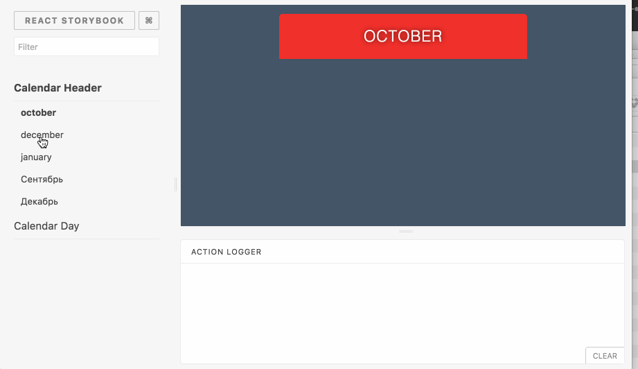

# Storybooking an Elm App

<table>
<tr>
  <td></td>
  <td></td>
</tr>
</table>

This demo demonstrates a simple calendar built with Elm and ["storybooked"](https://ouicar.github.io/2016/08/28/storybook.html) using [React Storybook](https://github.com/storybooks/react-storybook). 

React Storybook is an amazing tool that provides the ability to isolate UI Components for testing/documentation purposes. 

- [Elm App Demo](https://kalutheo.github.io/elm-calendar-react-storybook) 

- [StoryBook Demo](https://kalutheo.github.io/elm-calendar-react-storybook/storybook-static) 


## How can we achieve that ? 

- The Calendar is broken down into two small Apps (CalendarHeader, CalendarDay)
- We use [`programWithFlags`](http://package.elm-lang.org/packages/elm-lang/html/1.1.0/Html-App#programWithFlags)so that we can inject data from Javascript to Elm
- We import these Elm Apps into ReactStoryBook thanks to the [elm-webpack-loader](https://github.com/rtfeldman/elm-webpack-loader)
- These Elm Apps are then wrapped into React thanks to a small wrapper (see : [src/stories/Elm.js](https://github.com/kalutheo/elm-calendar-react-storybook/blob/master/app/stories/Elm.js))


## How to run the demo ? 

- In case you don't have ELM :
```
npm install elm -g
```

- Elm-App Package Installation : 
```
npm install create-elm-app -g
```

- Install project dependencies : 
```
cd app
elm-package install
npm-install
```

- Run Elm App : 
```
elm-app start
```

- Run Storybook : 
```
npm run storybook
```

We can now write happy Elm stories :smile:

* * *

*Html and css is forked from http://codepen.io/miroot/pen/aHCIg from [@mirot](http://codepen.io/miroot/)*
